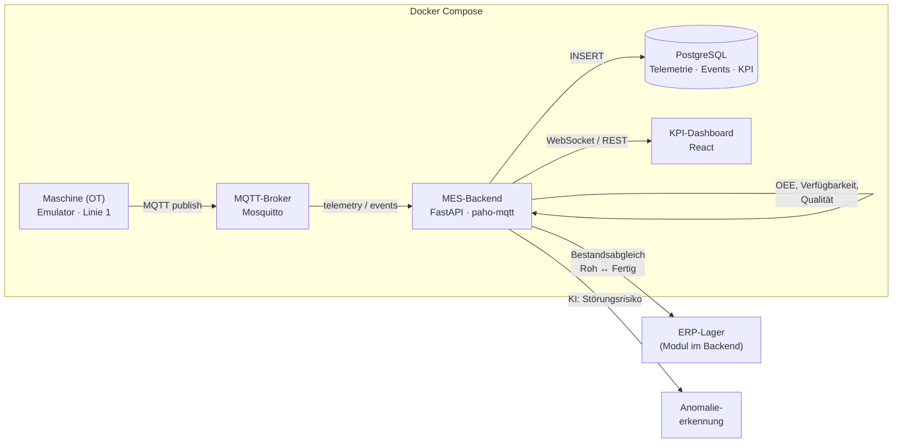

# Architektur

Ein Maschinenereignis durchläuft die gesamte Kette — von der Anlage (OT) bis
zum Lagerbestand (ERP) und ins Dashboard.

## Datenfluss

1. **OT** — Der Emulator bildet Linie 1 als Zustandsmaschine ab
   (`running` / `idle` / `error`) und veröffentlicht pro Sekunde Telemetrie
   sowie Zustandswechsel als MQTT-Nachrichten.
2. **MQTT** — Mosquitto entkoppelt Anlage und IT (OT/IT-Grenze).
3. **MES-Backend** — FastAPI abonniert die Topics, berechnet die MES-Kennzahlen
   (OEE = Verfügbarkeit × Leistung × Qualität) und schreibt Rohdaten, Ereignisse
   und periodische KPI-Snapshots nach PostgreSQL.
4. **ERP-Lager** — Jede produzierte Flasche verbucht Materialverbrauch
   (Vorformlinge) und Fertigwarenzugang; bei Unterschreiten des Meldebestands
   wird automatisch ein Wareneingang gebucht.
5. **KI** — Ein IsolationForest bewertet auf einem gleitenden Fenster das
   Störungsrisiko der Anlage.
6. **Dashboard** — React erhält den Live-Zustand über WebSocket: MES-Kennzahlen
   links, Lagerbestand rechts.

## Topics

| Topic | Inhalt |
| --- | --- |
| `mini-mes/line1/telemetry` | Status, Stückzahl, Ausschuss, Taktzeit (pro Tick) |
| `mini-mes/line1/events` | Zustandswechsel (Störung, Leerlauf, Wiederanlauf) |
